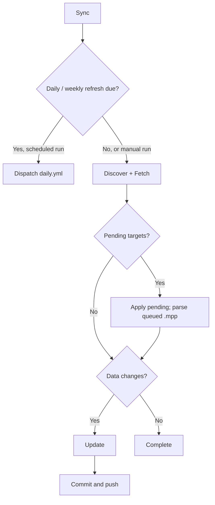
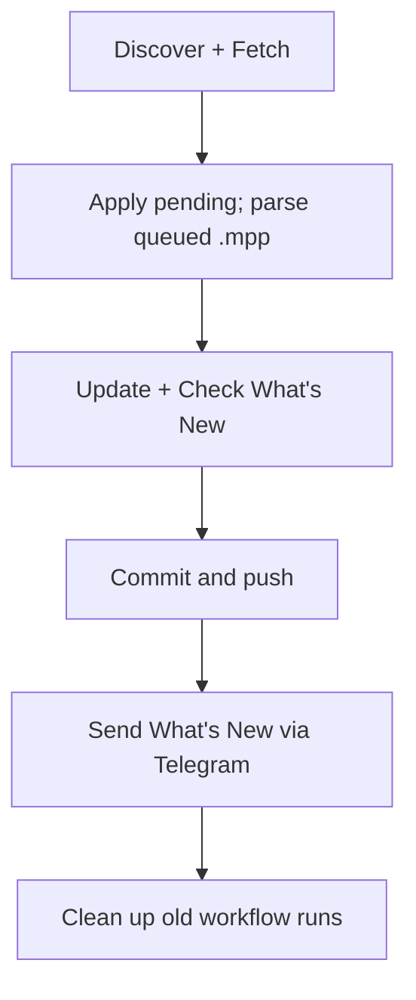
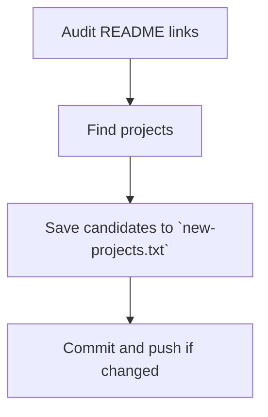

## [nvbangg/awesome-morphe](https://github.com/nvbangg/awesome-morphe)

> [!NOTE]
> This document describes the project structure, automation workflows, and data-processing logic behind the [Awesome Morphe Website](https://awesome-morphe.vercel.app/).

## 📂 Project Structure

```text
awesome-morphe/
├── .github/                            # Automation workflows
├── data/                               # Raw fetched data, source configuration & sync state
├── scripts/                            # Automated data-processing scripts
├── web/                                # Website source code
│   ├── public/
│   │   ├── bundles.json                # Metadata of all active bundles, patches & apps
│   │   └── whats-new.json              # Rolling changelog
│   └── ...                             # Other supporting files
├── CONTRIBUTING.md
├── LICENSE
└── README.md
```

## 🤖 Automation Workflows

### [Sync Workflow](../../actions/workflows/ci.yml) (ci.yml)

Runs hourly at minute 17 or manually. Scheduled runs dispatch the Daily / Weekly workflow when a refresh is due; otherwise, they perform a fast sync.



### [Daily / Weekly Workflow](../../actions/workflows/daily.yml) (daily.yml)

Triggered by Sync or manually:

- **`daily`:** Syncs bundles, checks bundle images, and refreshes repository metadata.
- **`weekly`:** Also checks existing bundle downloads and refreshes all Google Play metadata.

Both modes update public data, generate the changelog, and clean up old workflow runs. Pending updates are applied whenever present; Java is set up and the parser runs only when the `.mpp` queue is nonempty.



### [Check Projects Workflow](../../actions/workflows/check-projects.yml) (check-projects.yml)

Runs every Sunday at 01:00 UTC or manually. Audits configured README links and finds standalone Morphe projects for manual review.



## 🛠️ Scripts

Core automation scripts are written in Python under [`scripts/`](./scripts/).

### [`discover.py`](./scripts/discover.py)

Collects bundle sources from the providers below and synchronizes [`data/repos.json`](./data/repos.json).

#### Discovered Sources

- Custom sources in [`data/discover/custom.json`](./data/discover/custom.json)
- [Morphe Community Patches](https://morphe-patches.software)
- [Jman's ReVanced Patch Bundles](https://github.com/Jman-Github/ReVanced-Patch-Bundles)
- [Morphe Archive](https://github.com/rushiforai/morphe-archive)

#### Custom Configuration

Add sources to [`data/discover/custom.json`](./data/discover/custom.json), or set `enabled: false` to exclude them.

```json
{
  "https://github.com/owner/repo-to-add": {},
  "https://gitlab.com/owner/repo-to-exclude": {
    "enabled": false
  }
}
```

### [`fetch.py`](./scripts/fetch.py)

Checks and downloads bundle updates for repositories in [`data/repos.json`](./data/repos.json), storing GitHub and GitLab data separately.

#### Update Processing

Checks the content hashes of `patches-bundle.json` on `main` and `dev`. For changed targets, it downloads:

- Bundle metadata to [`data/bundles/`](./data/bundles/).
- The corresponding `.mpp` to [`scripts/bundle-parser/mpp/`](./scripts/bundle-parser/mpp/) to extract the bundle name.
- `patches-list.json` to [`data/patches/`](./data/patches/), when it can be downloaded and decoded.

If the patch list cannot be retrieved, the `.mpp` is queued in [`scripts/bundle-parser/updated_files.txt`](./scripts/bundle-parser/updated_files.txt) for parsing. Pending names and hashes are saved to [`scripts/bundle-parser/pending_repos.json`](./scripts/bundle-parser/pending_repos.json) for [`parse.py`](./scripts/parse.py) to apply.

HTTP 404/451 responses mark targets unavailable; other request failures generally preserve existing hashes for retry.

#### Execution Modes

- **Default:** Checks and downloads bundle updates.
- **`--daily`:** Also checks the content hashes of `patches-bundle.png`.
- **`--weekly`:** Includes daily behavior and checks `.mpp` download availability for unchanged bundles, excluding unavailable targets.

### [`parse.py`](./scripts/parse.py)

Runs the Kotlin-based [`bundle-parser`](./scripts/bundle-parser/) (adapted from [Jman's ReVanced Patch Bundles](https://github.com/Jman-Github/ReVanced-Patch-Bundles) to fit this project and Morphe) on `.mpp` files listed in [`scripts/bundle-parser/updated_files.txt`](./scripts/bundle-parser/updated_files.txt), saving patch lists to [`data/patches/`](./data/patches/).

Applies pending hashes from [`scripts/bundle-parser/pending_repos.json`](./scripts/bundle-parser/pending_repos.json) to [`data/repos.json`](./data/repos.json). Before each parser run, the previous success list is removed. A queued target is accepted only when the current process succeeds, lists that target in `parsed_files.txt`, and produces a patch list accepted by the existing data validation. Bundle names are read from the manifests of accepted branch updates, so a failed branch cannot supply another branch's name.

A process failure returns a nonzero exit code and rejects all queued targets from that run. When the process succeeds with individual target failures, valid targets are still accepted and failed targets retain their previous hashes for retry. Pending updates from directly downloaded patch lists and images can be applied without Java; independent updates can also be applied when the parser process fails, but the failure stops subsequent workflow steps.

### [`update.py`](./scripts/update.py)

Compiles bundle, patch, and app data into [`web/public/bundles.json`](./web/public/bundles.json).

#### Bundle Selection

Selects the valid GitHub or GitLab source with the newest `created_at` value. Ties keep the current source, or prefer GitHub for new bundles. Within that source, `dev` is selected when it is newer than `main` or no valid `main` exists; otherwise, `main` is selected.

Bundles without valid `main` data are marked prerelease. Patches found only in `dev` are also marked prerelease when compared with `main`. Invalid bundles are excluded.

#### Metadata and Cleanup

Fetches repository metadata from GitHub/GitLab and app metadata from Google Play. Nonempty app names, icons, and descriptions from [`data/official-bundles.json`](./data/official-bundles.json) take priority.

Removes orphaned bundle and patch files and apps no longer supported by any bundle.

#### Execution Modes

- **Default:** Fetches repository metadata for new bundles and missing app metadata.
- **`--daily`:** Refreshes repository metadata for all bundles and fetches missing app metadata.
- **`--weekly`:** Includes daily behavior and refreshes Google Play metadata for all apps.

### [`whats_new.py`](./scripts/whats_new.py)

Compares current bundle, app, and patch names with [`data/history.json`](./data/history.json) to identify additions. Saves the latest 14 changelog entries to [`web/public/whats-new.json`](./web/public/whats-new.json), generates [`scripts/temp/whats-new.md`](./scripts/temp/whats-new.md) when there is content to announce, and updates history when a new entry is created.

### [`telegram.py`](./scripts/telegram.py)

Sends update notifications using `TG_TOKEN` and `TG_CHAT`.

- **Default:** Sends [`scripts/temp/whats-new.md`](./scripts/temp/whats-new.md) with the title `🔔 What's New (Month Day)`.
- **`"Custom Title"`:** Uses a custom title.
- **`"Custom Title" "path/to/file.md"`:** Uses a custom title and file.

### [`audit_readme.py`](./scripts/audit_readme.py)

Checks repositories in [`data/projects/readme-repos.txt`](./data/projects/readme-repos.txt) and links in [`data/projects/readme-links.txt`](./data/projects/readme-links.txt) for unavailable, archived, renamed, or redirected targets. Reports findings without editing README.

### [`find_projects.py`](./scripts/find_projects.py)

Searches GitHub for standalone Morphe projects, excluding known repositories and those with `patches-bundle.json` on `main` or `dev`. Candidates must have a README. Saves results to [`data/projects/new-projects.txt`](./data/projects/new-projects.txt) for review.

## 🌐 Website Logic

The website loads its bundle data from [`web/public/bundles.json`](./web/public/bundles.json) and changelog from [`web/public/whats-new.json`](./web/public/whats-new.json).

### Sorting

#### Apps

- **Default:** Most Google Play installs, then most patches and alphabetical order. Universal patches are always listed last.
- Other options sort by newest, recently updated, most patches, or alphabetical order, falling back to the default order when values are equal.

#### Bundles

- **Default:** Official bundles follow the Hot ranking from [Morphe Community Patches](https://morphe-patches.software/), with `MorpheApp/morphe-patches` first. Other bundles updated within 30 days are sorted by stars, then last update; older bundles are sorted by last update, then stars. [`update.py`](./scripts/update.py) stores the final order as `hotRank`.
- Other options sort by newest, recently updated, stars, app count, patch count, or alphabetical order. Ties use the default rank.

#### Patches

Patches first seen within the last seven days are shown first, with newer patches ahead of older ones. Other patches keep their original order.

### Search and Filters

Search ignores case, accents, spaces, and punctuation. All search words must match:

- Apps are searched by name, package name, and description.
- Bundles are searched by name, source, and repository.
- Detail views also search app, bundle, patch, and patch-option information.

App filters use Google Play categories, while bundle filters separate official and unofficial sources.

### Status Labels

- **New:** First discovered within the last seven days.
- **Pre-release:** Available only from prerelease bundle or patch data. An app is prerelease when all its patches are prerelease.
- **Unofficial:** The bundle is not included in the official Morphe source list.
- **Archived:** The source repository is archived.
- **off:** The patch is disabled by default.

### URL Navigation

The URL stores the active tab, category, and sorting in its hash, such as `#apps:updated` or `#bundles:official:stars`. Query parameters open specific content directly:

- `?app=package.name` opens an app.
- `?github=owner/repo` or `?gitlab=owner/repo` opens a bundle.
- `?patch=patch-name` searches within the opened app or bundle.

### Test Bundle

Test Bundle accepts a GitHub or GitLab repository URL and previews valid `patches-list.json` data from its `main` and `dev` branches. It does not parse `.mpp` files or add the repository to the public database.

## 💻 Local Development

Run commands from the repository root unless stated otherwise.

### Website

```sh
cd web
npm ci
npm run dev
```

Open the local URL shown in the terminal.

### Data Scripts

```sh
python -m pip install -e scripts/
python scripts/discover.py
python scripts/fetch.py
python scripts/parse.py
python scripts/update.py
```

Set `GITHUB_TOKEN` for authenticated GitHub requests. Parsing `.mpp` files requires JDK 21 and GitHub Packages credentials: `GITHUB_ACTOR` and `GITHUB_TOKEN`, or Gradle properties `gpr.user` and `gpr.key`.

### Checks

Run website checks from [`web/`](./web/):

```sh
npm run check
npm run build
```

Run Python checks from the repository root:

```sh
python -m pip install ruff
ruff check --fix scripts/
ruff format scripts/
```

Run parser regression tests from [`scripts/`](./scripts/). They use temporary local fixtures and mock Gradle; no bundles are downloaded or executed:

```sh
python -B -m unittest discover -s tests -v
```

Lint and formatting commands may modify files.
