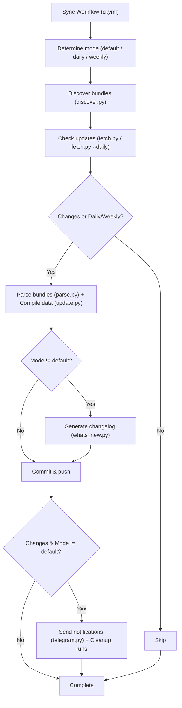
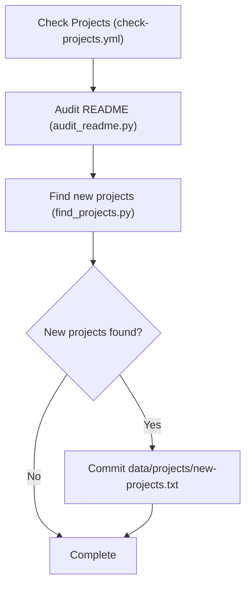

## [nvbangg/awesome-morphe](https://github.com/nvbangg/awesome-morphe)

> [!NOTE]
> This document contains the project structure and automation workflows for the [Awesome Morphe Website](https://awesome-morphe.vercel.app/).

## 📂 Project Structure

```text
awesome-morphe/
├── .github/                            # CI/CD workflows & configurations
├── data/                               # Raw data storage
├── scripts/                            # Automated scripts for data processing
│   ├── audit_readme.py                 # Audits repositories and external links in README
│   ├── discover.py                     # Discovers all bundles from providers
│   ├── fetch.py                        # Checks for updates and downloads bundles
│   ├── find_projects.py                # Searches and filters new Morphe repositories
│   ├── parse.py                        # Extracts patch metadata via bundle-parser
│   ├── telegram.py                     # Telegram notification service
│   ├── update.py                       # Compiles raw data into production JSONs
│   ├── whats_new.py                    # Generates What's New changelog
│   └── ...                             # Other supporting files
├── web/                                # Website source code
│   ├── public/
│   │   ├── bundles.json                # Metadata of all active bundles and apps
│   │   └── whats-new.json              # Rolling changelog (last 14 updates)
│   └── ...                             # Other supporting files
├── CONTRIBUTING.md
├── LICENSE
└── README.md
```

## 🤖 Automation Workflows

### 1. [Sync Workflow](../../actions/workflows/ci.yml)

Unified pipeline for synchronizing bundles, daily/weekly updates, and What's New changelogs:
- **`default` mode**: Fast sync hourly (skips images, commits only when new bundles are found).
- **`daily` mode**: Daily sync (fetches images, updates repo info/stars, generates What's New changelog, sends Telegram notifications, and cleans up old workflow runs).
- **`weekly` mode**: Weekly refresh every week (full re-scrape of Google Play metadata).



### 2. [Check Projects Workflow](../../actions/workflows/check-projects.yml) (Weekly on Sunday at 01:00 UTC)

Audits existing README entries and explores newly published Morphe projects:



## 🛠️ Usage / Scripts

All core automation logic is written in Python inside the `scripts/` directory.

### `discover.py`

Scans community patch repositories and synchronizes them directly into `data/repos.json` (adding new repositories and auto-pruning removed ones).

#### Discovered Sources

- nvbangg's custom sources defined in [`data/discover/custom.json`](data/discover/custom.json)
- [Morphe Community Patches](https://morphe-patches.software)
- [Jman's ReVanced Patch Bundles](https://github.com/Jman-Github/ReVanced-Patch-Bundles)
- [Morphe Archive](https://github.com/rushiforai/morphe-archive)

#### Customization

Manually add or remove target repositories in [`data/discover/custom.json`](data/discover/custom.json).

```json
{
  "https://github.com/owner/repo": {},
  "https://gitlab.com/owner/repo-to-exclude": {
    "enabled": false
  }
}
```

### `fetch.py`

Downloads raw patch lists and bundle metadata from remote sources based on `data/repos.json`.
It checks for new SHAs, downloads `patches-bundle.json` into `data/bundles/`, the corresponding `.mpp` file into `scripts/bundle-parser/mpp/` to extract the bundle name, and `patches-list.json` (if available) into `data/patches/`. Pending SHA and name updates are written to `scripts/bundle-parser/pending_repos.json`. Updated `.mpp` target paths are written to `scripts/bundle-parser/updated_files.txt` (only generated when there are bundles without a `patches-list.json`). With the `--daily` flag, it also fetches the bundle avatar image SHA for each repo.

### `parse.py`

Executes the Kotlin-based `bundle-parser` (adapted from [Jman's ReVanced Patch Bundles](https://github.com/Jman-Github/ReVanced-Patch-Bundles) to fit this project and Morphe) to parse `.mpp` files listed in `scripts/bundle-parser/updated_files.txt` and extract structured patch lists into `data/patches/`. Upon successful parsing, it commits pending commit SHAs and bundle names from `scripts/bundle-parser/pending_repos.json` into `data/repos.json`.

### `update.py`

Compiles and syncs data from raw JSON files (`data/repos.json`, `data/bundles/`, and `data/patches/`) into the main public database file (`web/public/bundles.json`). Missing metadata is scraped from Google Play (with a fallback to official Morphe data) or fetched via GitHub/GitLab APIs. It automatically cleans up orphaned bundle and patch files from local storage if they no longer exist in `data/repos.json`.

Supported execution modes:

- **Default mode**: Compiles data from local JSON files, fetches GitHub/GitLab repository info (stars, avatar, and repository description) for new bundles, and retrieves any missing app metadata (name, icon, or description) from Google Play for newly discovered apps not yet available locally.
- `--daily`: Same as default, but also refreshes GitHub/GitLab repository info for all bundles and retrieves any missing app metadata from Google Play for all existing apps.
- `--weekly`: Same as `--daily`, but also forces a full re-scrape of all app metadata from Google Play for all existing applications, overwriting current values.

### `whats_new.py`

Generates `web/public/whats-new.json` (rolling changelog for the website) and `scripts/temp/whats-new.md` (used for Telegram notifications) by comparing current patch data against the previous state in `data/history.json`.

### `telegram.py`

Sends update notifications to a Telegram channel (`TG_CHAT`) using the Telegram Bot API (`TG_TOKEN`). Supports the following usage:

- **Default**: Posts `scripts/temp/whats-new.md` with an auto-generated title (`🔔 What's New (Month Day)`).
- With `"Custom Title"`: Posts `scripts/temp/whats-new.md` with the specified title.
- With `"Custom Title" "path/to/file.md"`: Posts the specified markdown file with the specified title.

### `audit_readme.py`

Audits repositories in `data/projects/readme-repos.txt` and external links in `data/projects/readme-links.txt`, checking for broken links, deleted repositories, or archived projects to ensure all README references remain active and healthy.

### `find_projects.py`

Discovers and filters new standalone Morphe patch repositories across GitHub, verifies that each candidate contains valid patch bundles, and saves results to `data/projects/new-projects.txt` for review.
