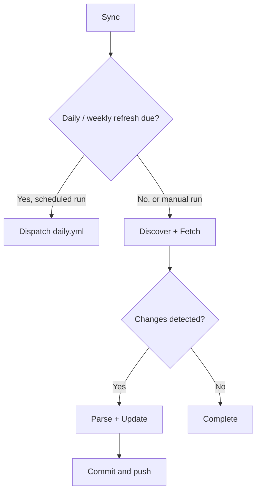
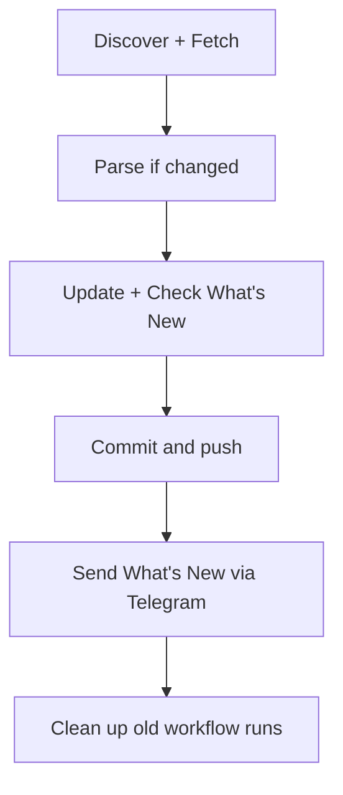
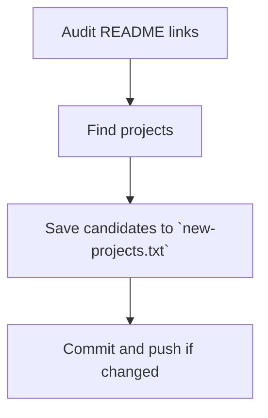

## [nvbangg/awesome-morphe](https://github.com/nvbangg/awesome-morphe)

> [!NOTE]
> This document describes the project structure, automation workflows, and data-processing logic behind the [Awesome Morphe Website](https://awesome-morphe.vercel.app/).

## 📂 Project Structure

```text
awesome-morphe/
├── .github/                            # Automation workflows
├── data/                               # Raw fetched data, source configuration & sync state
├── scripts/                            # Automated data-processing scripts
├── web/                                # Website source code
│   ├── public/
│   │   ├── bundles.json                # Metadata of all active bundles, patches & apps
│   │   └── whats-new.json              # Rolling changelog
│   └── ...                             # Other supporting files
├── CONTRIBUTING.md
├── LICENSE
└── README.md
```

## 🤖 Automation Workflows

### [Sync Workflow](../../actions/workflows/ci.yml) (ci.yml)

Runs hourly at minute 17 or manually. Scheduled runs dispatch the Daily / Weekly workflow when a refresh is due; otherwise, they perform a fast sync.



### [Daily / Weekly Workflow](../../actions/workflows/daily.yml) (daily.yml)

Triggered by Sync or manually:

- **`daily`:** Syncs bundles, checks bundle images, and refreshes repository metadata.
- **`weekly`:** Also checks existing bundle downloads and refreshes all Google Play metadata.

Both modes update public data, generate the changelog, and clean up old workflow runs. Parsing runs only when changes are detected.



### [Check Projects Workflow](../../actions/workflows/check-projects.yml) (check-projects.yml)

Runs every Sunday at 01:00 UTC or manually. Audits configured README links and finds standalone Morphe projects for manual review.



## 🛠️ Scripts

Core automation scripts are written in Python under [`scripts/`](./scripts/).

### [`discover.py`](./scripts/discover.py)

Collects bundle sources from the providers below and synchronizes [`data/repos.json`](./data/repos.json).

#### Discovered Sources

- Custom sources in [`data/discover/custom.json`](./data/discover/custom.json)
- [Morphe Community Patches](https://morphe-patches.software)
- [Jman's ReVanced Patch Bundles](https://github.com/Jman-Github/ReVanced-Patch-Bundles)
- [Morphe Archive](https://github.com/rushiforai/morphe-archive)

#### Custom Configuration

Add sources to [`data/discover/custom.json`](./data/discover/custom.json), or set `enabled: false` to exclude them.

```json
{
  "https://github.com/owner/repo-to-add": {},
  "https://gitlab.com/owner/repo-to-exclude": {
    "enabled": false
  }
}
```

### [`fetch.py`](./scripts/fetch.py)

Checks and downloads bundle updates for repositories in [`data/repos.json`](./data/repos.json).

#### Update Processing

Checks the content hashes of `patches-bundle.json` on `main` and `dev`. For changed targets, it downloads:

- Bundle metadata to [`data/bundles/`](./data/bundles/).
- The corresponding `.mpp` to [`scripts/bundle-parser/mpp/`](./scripts/bundle-parser/mpp/) to extract the bundle name.
- `patches-list.json` to [`data/patches/`](./data/patches/), when it can be downloaded and decoded.

If the patch list cannot be retrieved, the `.mpp` is queued in [`scripts/bundle-parser/updated_files.txt`](./scripts/bundle-parser/updated_files.txt) for parsing. Pending names and hashes are saved to [`scripts/bundle-parser/pending_repos.json`](./scripts/bundle-parser/pending_repos.json) for [`parse.py`](./scripts/parse.py) to apply.

HTTP 404/451 responses mark targets unavailable; other request failures generally preserve existing hashes for retry.

#### Execution Modes

- **Default:** Checks and downloads bundle updates.
- **`--daily`:** Also checks the content hashes of `patches-bundle.png`.
- **`--weekly`:** Includes daily behavior and checks `.mpp` download availability for unchanged bundles, excluding unavailable targets.

### [`parse.py`](./scripts/parse.py)

Runs the Kotlin-based [`bundle-parser`](./scripts/bundle-parser/) (adapted from [Jman's ReVanced Patch Bundles](https://github.com/Jman-Github/ReVanced-Patch-Bundles) to fit this project and Morphe) on `.mpp` files listed in [`scripts/bundle-parser/updated_files.txt`](./scripts/bundle-parser/updated_files.txt), saving patch lists to [`data/patches/`](./data/patches/).

Applies pending names and hashes from [`scripts/bundle-parser/pending_repos.json`](./scripts/bundle-parser/pending_repos.json) to [`data/repos.json`](./data/repos.json). Queued bundles have their content hashes updated only after successful parsing.

### [`update.py`](./scripts/update.py)

Compiles bundle, patch, and app data into [`web/public/bundles.json`](./web/public/bundles.json).

#### Bundle Selection

Uses GitHub data first, falling back to GitLab if no valid branch is available. Selects `dev` when it is newer than `main` or no valid `main` exists; otherwise, selects `main`.

Bundles without valid `main` data are marked prerelease. Patches found only in `dev` are also marked prerelease when compared with `main`. Invalid bundles are excluded.

#### Metadata and Cleanup

Fetches repository metadata from GitHub/GitLab and app metadata from Google Play. Nonempty app names, icons, and descriptions from [`data/official-bundles.json`](./data/official-bundles.json) take priority.

Removes orphaned bundle and patch files and apps no longer supported by any bundle.

#### Execution Modes

- **Default:** Fetches repository metadata for new bundles and missing app metadata.
- **`--daily`:** Refreshes repository metadata for all bundles and fetches missing app metadata.
- **`--weekly`:** Includes daily behavior and refreshes Google Play metadata for all apps.

### [`whats_new.py`](./scripts/whats_new.py)

Compares current bundle, app, and patch names with [`data/history.json`](./data/history.json) to identify additions. Saves the latest 14 changelog entries to [`web/public/whats-new.json`](./web/public/whats-new.json), generates [`scripts/temp/whats-new.md`](./scripts/temp/whats-new.md) when there is content to announce, and updates history when a new entry is created.

### [`telegram.py`](./scripts/telegram.py)

Sends update notifications using `TG_TOKEN` and `TG_CHAT`.

- **Default:** Sends [`scripts/temp/whats-new.md`](./scripts/temp/whats-new.md) with the title `🔔 What's New (Month Day)`.
- **`"Custom Title"`:** Uses a custom title.
- **`"Custom Title" "path/to/file.md"`:** Uses a custom title and file.

### [`audit_readme.py`](./scripts/audit_readme.py)

Checks repositories in [`data/projects/readme-repos.txt`](./data/projects/readme-repos.txt) and links in [`data/projects/readme-links.txt`](./data/projects/readme-links.txt) for unavailable, archived, renamed, or redirected targets. Reports findings without editing README.

### [`find_projects.py`](./scripts/find_projects.py)

Searches GitHub for standalone Morphe projects, excluding known repositories and those with `patches-bundle.json` on `main` or `dev`. Candidates must have a README. Saves results to [`data/projects/new-projects.txt`](./data/projects/new-projects.txt) for review.
